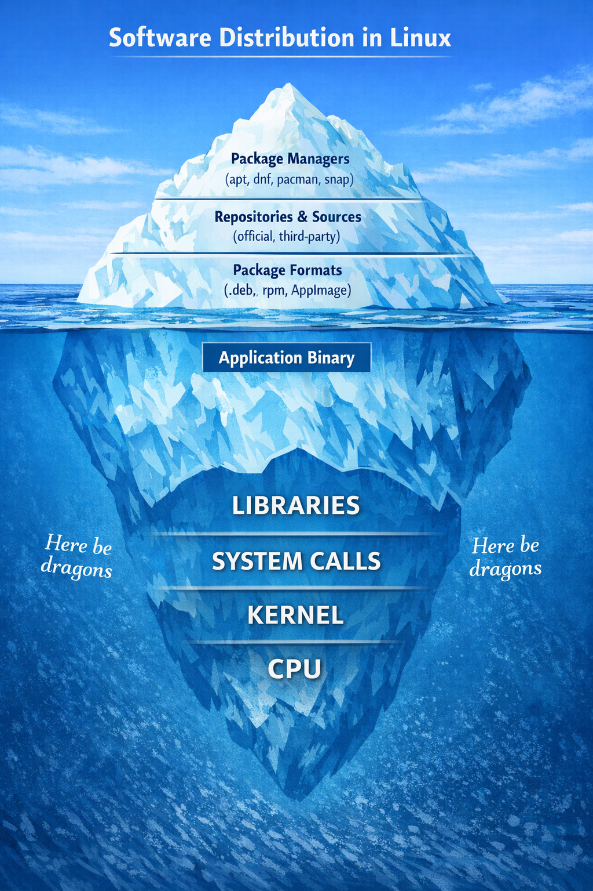
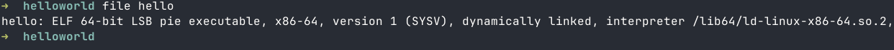
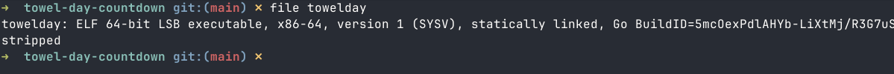
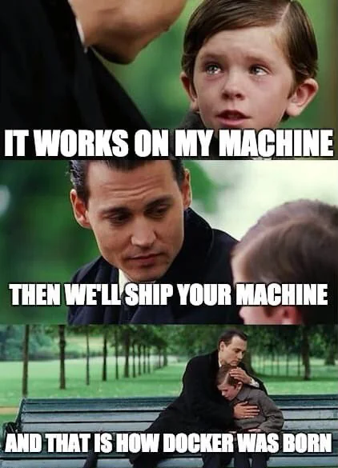

# App Packaging in Linux 

Bobby Alex Philip

---

 

---
<!-- _header: "**Now to answer an important question**" -->
  * Not the answer to the Ultimate Question of Life, the Universe, and Everything 
      * _We already know that is 42_
  * How many sleeps to International Towel Day?


---
<!-- _header: "**WHAT IS AN EXECUTABLE**" -->

* Source code → compiled into a binary (machine code)
* On Linux: typically an **ELF (Executable and Linkable Format)** file
* It can be:
  - **Statically linked** (everything included)
  - **Dynamically linked** (uses shared libraries)
* ```printf("Hello World!\n")```
   - printf() → libc → syscall → kernel
---
<!-- _header: "**Default C vs Go Compiled Binary**" -->
 

    


<!--
strings towelday | grep -i towel #to show parts of what is in a binary
-->

---
<!-- _header: "**HOW TO DISTRIBUTE THIS**" -->



---
<!-- _header: "**HOW TO DISTRIBUTE THIS ON DESKTOP**" -->


---
<!--_header: "**DISTRO-SPECIFIC PACKAGING**" -->

- Software is packaged specifically for each Linux distribution (e.g. deb, rpm)
- Delivered via repositories (official/community)
- Shared system libraries reduce duplication at the cost of complexity
- Stable vs Speedy updates

---
<!--_header: "**DISTRO PACKAGE FORMATS**" -->

| Format | Used By                  | Package Manager |
|--------|--------------------------|-----------------|
| .deb   | Debian, Ubuntu,Linux Mint | apt / dpkg     |
| .rpm   | Fedora, RHEL, CentOS     | dnf / yum       |
| .pkg.tar.zst | Arch Linux         | pacman          |
| .apk   | Alpine Linux             | apk             |

---
<!--_header: "**DISTRO AGNOSTIC PACKAGING**" -->
 - Reach all users via a single channel
 - Users can receive the latest software versions instantly
 - No need to cater to specific distro packaging requirements
 - Bundle all necessary dependencies to eliminate "dependency hell"
 - Larger application size

---
<!--_header: "**DISTRO AGNOSTIC PACKAGING**" -->

| Feature            | AppImage                                                                 | Flatpak                                              | Snap                                                      |
|--------------------|-------------------------------------------------------------------------|------------------------------------------------------|-----------------------------------------------------------|
| Installation       | Single file, download and run                                           | Installed via flatpak tool                           | Installed via snapd service                               |
| Format             | ELF executable + SquashFS (read-only filesystem)                        | Bundle + runtime                                     | Self-contained package + base snap                        |
| Dependencies       | Bundled (except core system libs like glibc)                            | Provided by shared runtimes                          | Bundled with application                                  |
| Sandboxing         | None out of the box                                                     | Strong sandboxing                                    | Sandboxed (confinement levels)                            |
| Updates            | No automatic updates                                                    | Managed via flatpak                                  | Automatic updates by default                              |
| Distribution       | Decentralised                                                           | Centralised (Flathub + remotes)                      | Controlled by Canonical (Snap Store)                      |
| Portability Model  | Build on old, run on new                                                | Runtime ensures compatibility                        | Base snap + bundled dependencies                          |

---

